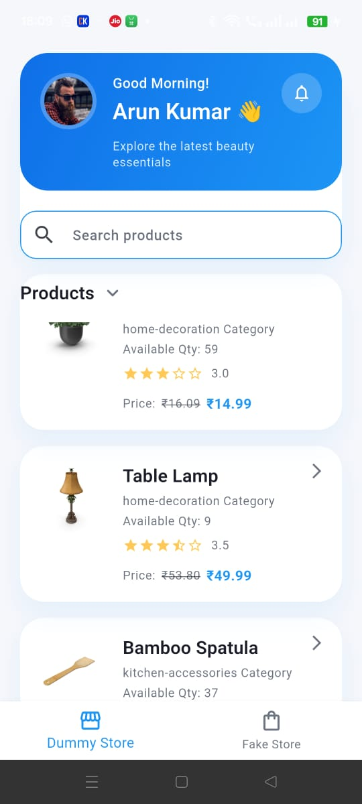
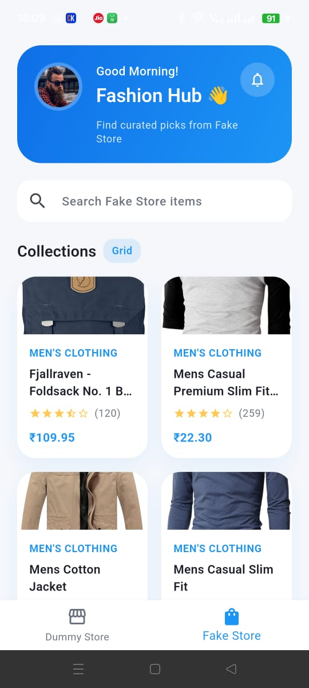
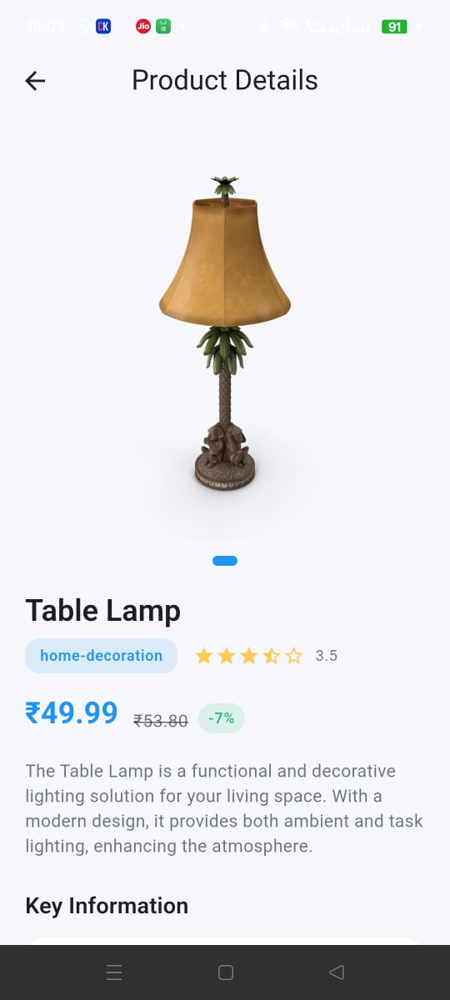

# Shop App

Flutter demo combining two product experiences:

- **Dummy Store** (dummyjson.com): infinite list with pagination, search, and detailed product view.
- **Fake Store** (fakestoreapi.com): curated grid listing with quick preview.

The UI follows a clean card layout inspired by the provided mockups and uses BLoC for simple, testable state management.

## Screenshots

Place the supplied JPEG images in `assets/screenshots/` with these names to render previews in this README.

## Getting Started

1. Copy `.env.example` to `.env` (already in repo) and adjust API endpoints if needed.
2. Run `flutter pub get`.
3. Launch with `flutter run`.

## Project Highlights

- Shared theming and header widgets for a consistent look across tabs.
- Repository layer + BLoC for both APIs with error handling/snackbars.
- Infinite scroll + manual search filter for Dummy Store.
- Carousel details, review list, and price formatting in product detail view.

Have fun exploring and feel free to extend with your own branding, analytics, or caching.
